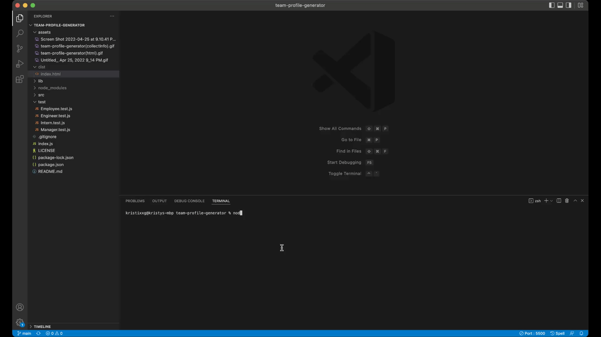
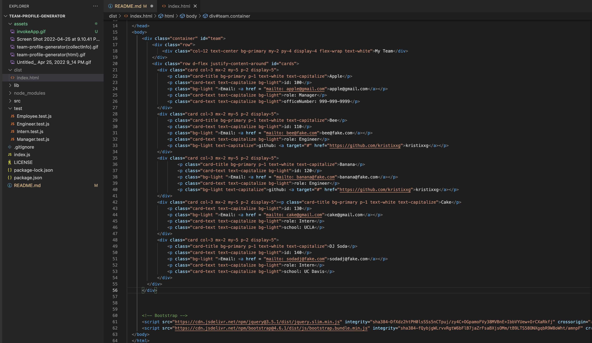

# Team Profile Generator
[](https://opensource.org/licenses/MIT)


## Description
This application is built using Node.js command-line that takes in information about employees on team then generates an HTML webpage that displays summaries for each person. There is test unit to ensure code passes each test. 


## Installation

The application uses [Jest](https://www.npmjs.com/package/jest) for running the unit tests and [Inquirer](https://www.npmjs.com/package/inquirer) for collecting input from the user.
```bash
npm install 
```


## Usage

 The application will be invoked by using the following command:

```bash
node index.js
```

## Video Walk-through

- Demonstration of how to invoke the application from the command line



- Demonstrate the functionality of the team profile generator
    - prompts user questions
    - how a user would enter responses to all of the prompt


2. Demonstrate a generated HTML file and shows a generated HTML file that matches the user input




3. Tests with Jest showing all four tests passing from the command line


## HTML Example


## License
[](https://opensource.org/licenses/MIT)

Copyright (c) 2022 Kristy Guo

Permission is hereby granted, free of charge, to any person obtaining a copy
of this software and associated documentation files (the "Software"), to deal
in the Software without restriction, including without limitation the rights
to use, copy, modify, merge, publish, distribute, sublicense, and/or sell
copies of the Software, and to permit persons to whom the Software is
furnished to do so, subject to the following conditions:

The above copyright notice and this permission notice shall be included in all
copies or substantial portions of the Software.

THE SOFTWARE IS PROVIDED "AS IS", WITHOUT WARRANTY OF ANY KIND, EXPRESS OR
IMPLIED, INCLUDING BUT NOT LIMITED TO THE WARRANTIES OF MERCHANTABILITY,
FITNESS FOR A PARTICULAR PURPOSE AND NONINFRINGEMENT. IN NO EVENT SHALL THE
AUTHORS OR COPYRIGHT HOLDERS BE LIABLE FOR ANY CLAIM, DAMAGES OR OTHER
LIABILITY, WHETHER IN AN ACTION OF CONTRACT, TORT OR OTHERWISE, ARISING FROM,
OUT OF OR IN CONNECTION WITH THE SOFTWARE OR THE USE OR OTHER DEALINGS IN THE
SOFTWARE.
